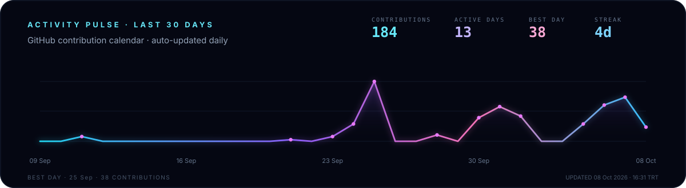

  

 

## About Me

I build **AI-powered products and intelligent software systems** — from machine learning and computer vision to LLM-based agents and backend services.

My focus is on turning models and ideas into **real, usable products** with strong engineering foundations.

  
  

 

  

 

## Selected Work

<table>
<tr>
<td width="33%" valign="top">

### 01 — Anadolu: Haber Zaman Tüneli

An interactive **3D news time-travel experience** built for the Media Technologies Hackathon.

Users can explore archived news in a Three.js gallery, listen through AI-powered TTS and watch automatically generated video summaries.

`Python` `Flask` `Three.js` `Transformers` `Whisper` `OpenAI`

[View project →](https://github.com/SevalSorak/Medya-Teknolojileri-Hackathonu)

</td>
<td width="33%" valign="top">

### 02 — Turkish AI Support Agent

A **Turkish-speaking AI customer support agent** powered by a local LLM and tool calling.

The system combines voice input/output, customer-support tools, local inference and modular agent architecture.

`Ollama` `Llama` `Whisper` `VITS` `LanceDB` `Python`

[View project →](https://github.com/SevalSorak/TurkceDogalDilIsleme2025BizTech)

</td>
<td width="33%" valign="top">

### 03 — Diş Sağlığım

An **AI-powered dental health platform** combining an Android application with computer vision and generative AI.

It includes image analysis, an AI assistant, personalized care plans and gamified learning.

`Kotlin` `FastAPI` `PyTorch` `Gemini` `Computer Vision`

[View project →](https://github.com/SevalSorak/PupilicaHackathon)

</td>
</tr>
</table>

 

  

 

## Tech Stack

  

  <code>Scikit-learn</code>
  <code>Pandas</code>
  <code>NumPy</code>
  <code>LLMs</code>
  <code>RAG</code>
  <code>AI Agents</code>

 

## GitHub Activity

  

 

### Let's Connect

**AI · Machine Learning · LLMs · Computer Vision · Software Engineering**

[LinkedIn](https://linkedin.com/in/sevalsorak) · [Email](mailto:sevalsorakk@gmail.com)

